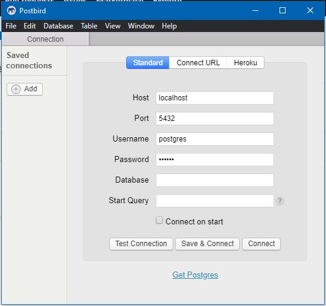

# Missão Rama web application Back-end 


### This is an API created to Missão Rama application

### Is in development

---

# Installation

>You'll need to have [`npm`](https://www.npmjs.com/), [`yarn`](https://yarnpkg.com/) and [`docker`](https://www.docker.com/)  and installed on your machine. 

## Install the dependencies

Just download it and run the next command:

```bash
yarn install
```

This will download all the dependencies

## Install the database with [`docker`](https://www.docker.com/)

On terminal run the next command:

```bash
docker run --name ramadatabase -e POSTGRES_PASSWORD=docker -p 5432:5432 -d postgres:11
```
Wait for the instalation...

Create a database on postgres container

>I like to use the [`Postbird`](https://www.electronjs.org/apps/postbird) interface for that.

So connect on database



>Port: 5432
>Username: postgres
>Password: docker

Go to:
- Select database
- Create database
- Call it Rama


## Change the env file

On .env file, put all informations you created so far

# Use

To start the API, run the next command:

```bash
yarn dev
```


# Dependencies

>    "bcryptjs": "^2.4.3",
>   "dotenv": "^8.2.0",
>    "express": "^4.17.1",
>    "jsonwebtoken": "^8.5.1",
>    "multer": "^1.4.2",
>    "pg": "^8.0.2",
>    "pg-hstore": "^2.3.3",
>    "sequelize": "^5.21.6"